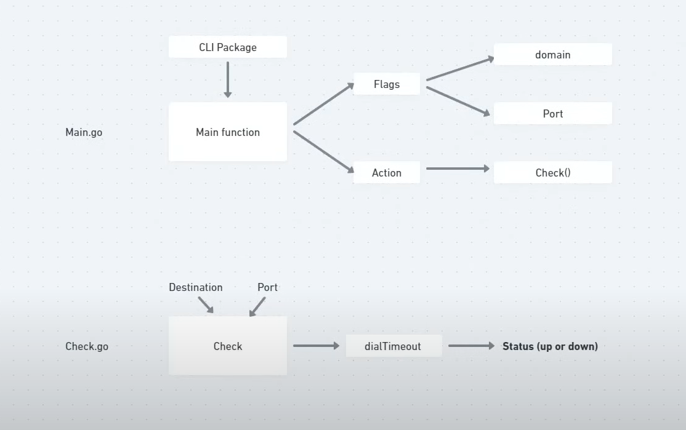

# Health Checker

Health Checker is a simple and efficient command-line application written in Go that allows you to check the health status of your services. This tool verifies if a specified domain and port are reachable, providing an easy way to monitor the availability of your services.

## Features

* Check the reachability of any domain and port.
* Default port is set to 80 if no port is specified.
* Provides a clear and concise status message indicating whether the destination is reachable or not.

## Installation

To install and use Health Checker, you need to have Go installed on your machine. If Go is not installed, you can download it from [here](https://golang.org/dl/).

1. Clone the repository:

    ```sh
    https://github.com/Aryan-tiwari/Health-Checker.git
    ```

2. Navigate to the project directory:

    ```sh
    cd healthchecker
    ```

3. Run the executable:

    ```sh
    go run . --domain example.com
    ```

## Design



